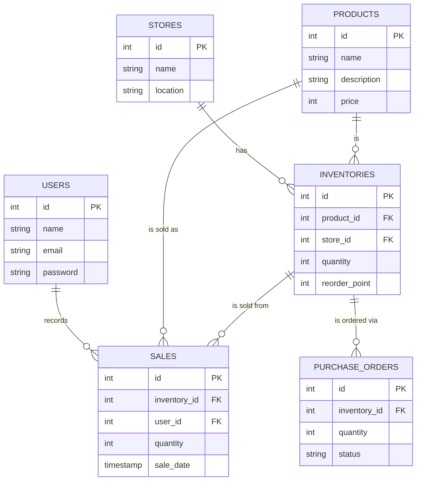
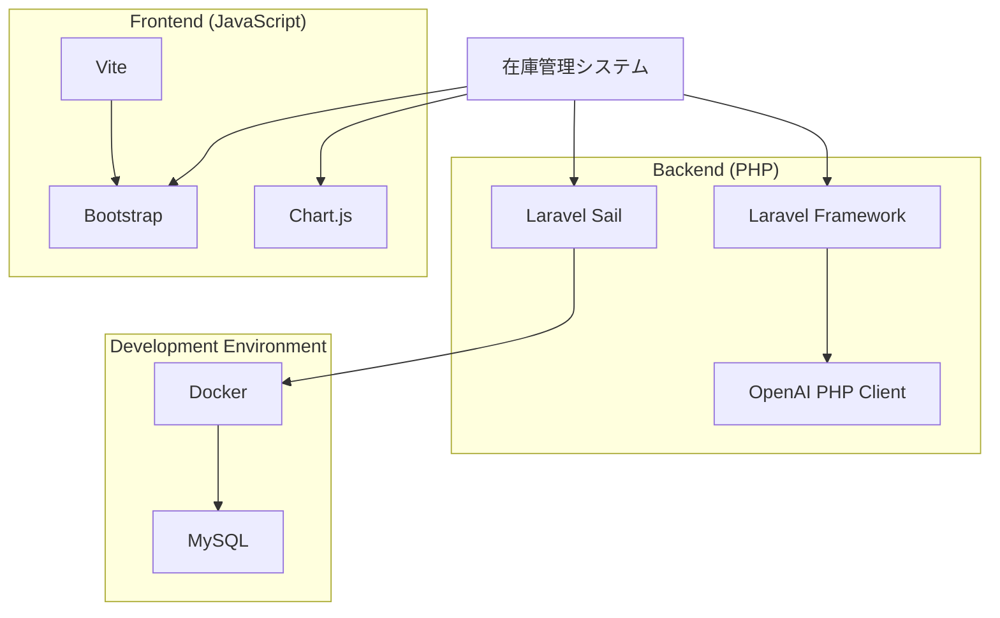
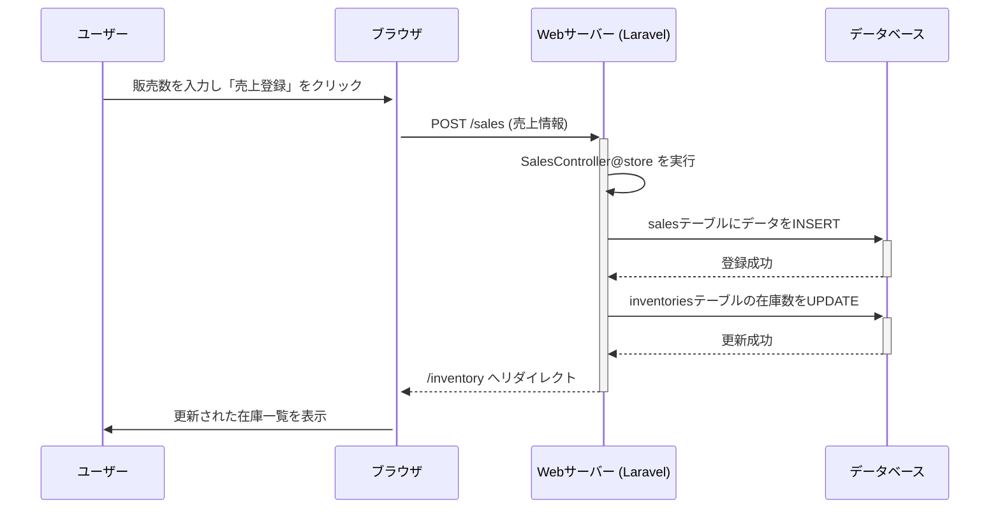

# 在庫管理システム (Inventory Management System)

## 📋 概要

Laravelフレームワークをベースに構築された在庫管理システムです。商品、店舗、在庫の基本的なCRUD機能に加え、売上登録、ダッシュボードでのデータ可視化、AIによる需要予測など、実践的な機能を備えています。

## ✨ 主な機能

### 🔐 認証機能
- ユーザー登録・ログイン・ログアウト
- パスワードリセット

### 📊 ダッシュボード
- 売上高や販売数などのKPIを期間ごとに表示
- グラフによる売上推移の可視化
- 在庫アラート（発注点を下回った在庫の通知）

### 📈 グラフ分析
- 月別、店舗別、商品別、曜日別など詳細な売上分析グラフ

### 📦 在庫管理
- 在庫情報の一覧、新規登録、編集、削除
- 商品名や店舗での絞り込み検索

### 💰 売上登録
- 在庫一覧から直接、販売数を入力して売上を登録
- 売上登録時に在庫数を自動で更新

### 🤖 AI需要予測
- 過去の売上データに基づき、AIが将来の需要と適切な発注数を予測

### 🗂️ マスタ管理
- 商品マスタ、ユーザーマスタの管理

### 👤 プロフィール管理
- ユーザー情報の更新、パスワード変更、アカウント削除

## 🗄️ データベース設計

### ER図



## 🏗️ システム構成

### システム依存関係



## 🔄 シーケンス図

### ユーザーログイン

```mermaid
sequenceDiagram
    participant User as ユーザー
    participant Browser as ブラウザ
    participant WebServer as Webサーバー (Laravel)
    participant Database as データベース

    User->>+Browser: メールアドレスとパスワードを入力しログイン
    Browser->>+WebServer: POST /login (ログインリクエスト)
    WebServer->>WebServer: バリデーション
    WebServer->>+Database: ユーザー情報を検索
    Database-->>-WebServer: ユーザー情報を返す
    alt 認証成功
        WebServer->>WebServer: セッション開始
        WebServer-->>-Browser: /dashboard へリダイレクト
        Browser->>+User: ダッシュボードを表示
    else 認証失敗
        WebServer-->>-Browser: エラーと共にログイン画面を再表示
        Browser->>+User: エラーを表示
    end
```

### 売上登録



## 🛠️ 技術スタック

| カテゴリ | 技術 |
|---------|------|
| **バックエンド** | Laravel, PHP |
| **データベース** | MySQL |
| **フロントエンド** | Blade, Bootstrap, Chart.js |
| **AI** | OpenAI API |
| **開発環境** | Docker (Laravel Sail) |

## 🚀 セットアップ

### 前提条件

- Docker Desktop がインストールされていること
- Git がインストールされていること

### インストール手順

#### 1. リポジトリのクローン

```bash
git clone https://github.com/taichan-33/inventory-system.git
cd inventory-system
```

#### 2. 環境ファイルの準備

```bash
cp .env.example .env
```

#### 3. Laravel Sailの起動

```bash
./vendor/bin/sail up -d
```

#### 4. 依存パッケージのインストール

```bash
./vendor/bin/sail composer install
./vendor/bin/sail npm install
```

#### 5. アプリケーションキーの生成

```bash
./vendor/bin/sail artisan key:generate
```

#### 6. データベースのマイグレーションと初期データ投入

```bash
./vendor/bin/sail artisan migrate --seed
```

> 💡 AdminUserSeeder により、テスト用の管理者ユーザーが作成されます

#### 7. フロントエンドアセットのビルド

```bash
./vendor/bin/sail npm run build
```

#### 8. アプリケーションへのアクセス

ブラウザで以下のURLにアクセス:

```
http://localhost
```

## 📖 使い方

### デモアカウント

| 項目 | 値 |
|------|-----|
| **メールアドレス** | exsample@gmail.com |
| **パスワード** | test1234 |

### 基本操作

1. 上記のデモアカウントでログイン
2. ナビゲーションバーから各機能へアクセス
3. ダッシュボードで全体の売上状況を確認
4. 在庫管理から在庫の追加・編集・削除
5. 売上登録から販売記録を登録

### AI需要予測の使用

1. 「AI予測」ページへアクセス
2. バッチ処理を実行
3. 推奨発注数を確認

> ⚠️ **注意**: AI需要予測を使用するには、`.env`ファイルにOpenAI APIキーの設定が必要です

```env
OPENAI_API_KEY=your-api-key-here
```

## 📁 ディレクトリ構造

```
inventory-system/
├── app/                    # アプリケーションコア
│   ├── Http/
│   │   └── Controllers/    # コントローラー
│   └── Models/             # Eloquentモデル
├── database/
│   ├── migrations/         # データベースマイグレーション
│   └── seeders/            # シーダー
├── public/                 # 公開ディレクトリ
├── resources/
│   ├── views/              # Bladeテンプレート
│   └── js/                 # JavaScriptファイル
├── routes/
│   └── web.php            # Webルート定義
├── docker-compose.yml     # Docker設定
└── .env.example           # 環境変数サンプル
```

## 🧪 テスト

```bash
./vendor/bin/sail artisan test
```

## 📝 ライセンス

このプロジェクトはMITライセンスの下で公開されています。

## 🤝 貢献

プルリクエストは歓迎します。大きな変更の場合は、まずissueを開いて、変更内容について議論してください。

## 📧 お問い合わせ

質問や提案がある場合は、[Issues](https://github.com/taichan-33/inventory-system/issues)を作成してください。

## 🙏 謝辞

- [Laravel](https://laravel.com)
- [Bootstrap](https://getbootstrap.com)
- [Chart.js](https://www.chartjs.org)
- [OpenAI](https://openai.com)

---

<p align="center">Made with ❤️ by taichan-33</p>